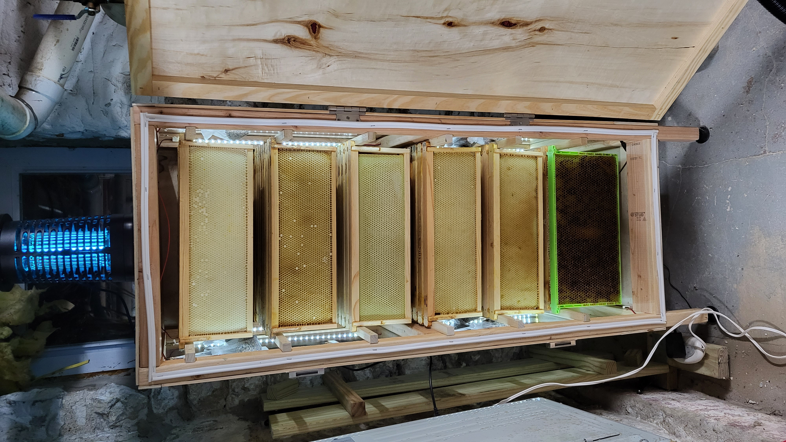
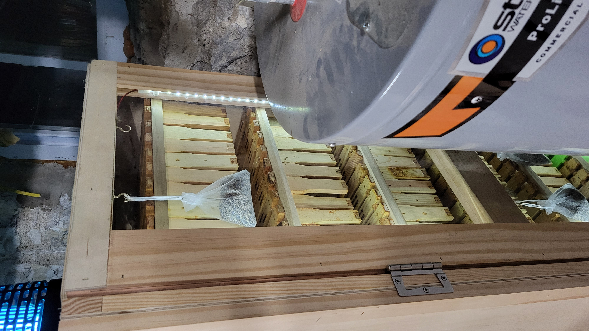
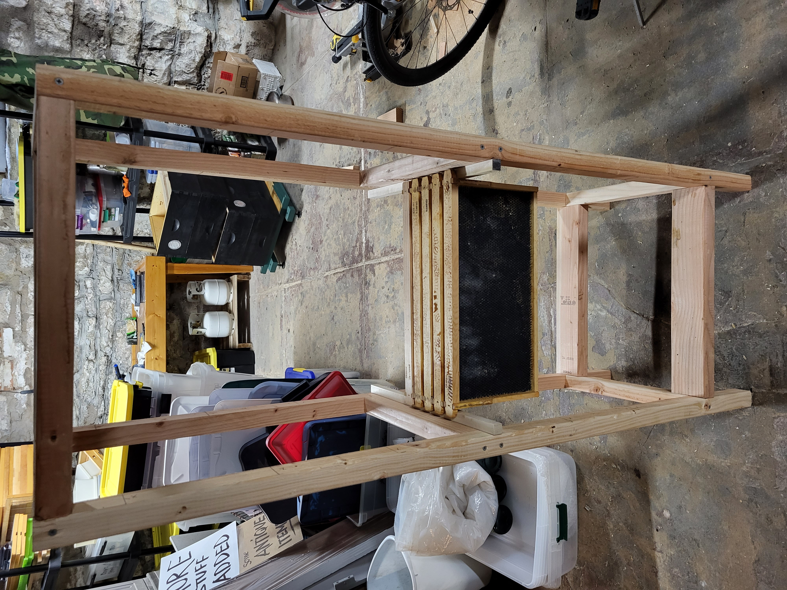
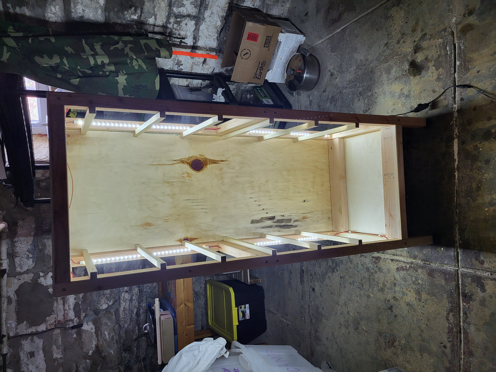
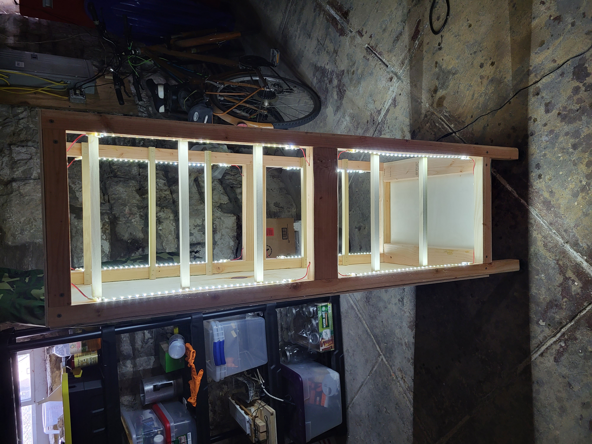

# frame storage cabinate

  

  

## BOM
- 2 x 4 x 8
    - cut in half for framing
- 3/8 plywood
- [PET sheet Panels](https://www.amazon.com/gp/product/B09XF22FS6/)
- 3/4 square stripping
- weather stripping
- hinges
- [led light strips](https://www.amazon.com/gp/product/B08CC1X5YJ)
- dried lavendar
- cloth bags

## assembly

  

  

  

  

