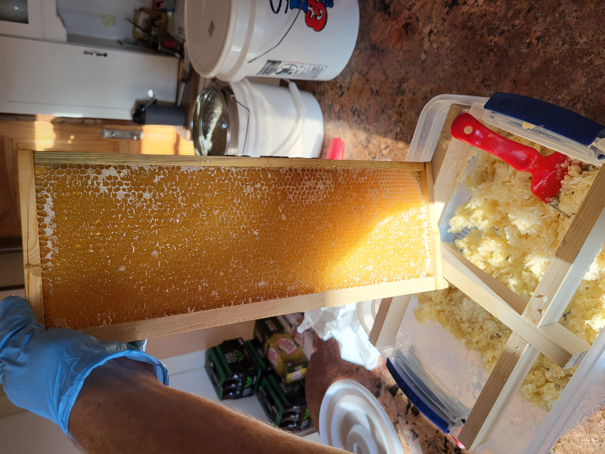

# Decapper tub

  

## BOM
- [Sterilite 15 Quart Stadium Blue Latch Box](https://www.walmart.com/ip/Sterilite-15-Quart-Stadium-Blue-Latch-Box/46001916?athbdg=L1100)
- [Sterilite 27 Quart Stadium Blue Latch Box](https://www.walmart.com/ip/Sterilite-27-Quart-Stadium-Blue-Latch-Box/46001917)
- [plastic queen excluder](https://www.acehardware.com/departments/lawn-and-garden/farm-and-ranch-supplies/bee-keeping-equipment/7460157?x429=true&msclkid=8c753049ac90175724715282337ef63c&gclsrc=ds&gclsrc=ds)
- [stainless steel 10 mesh](https://www.amazon.com/dp/B08CGSYV5S)
- [1 x 2 poplar](https://www.menards.com/main/building-materials/lumber-boards/boards/mastercraft-reg-1-x-2-poplar-board/1049326/p-1444422758808-c-13115.htm)
- 

## screen and opening. cutout on existing seam

  

## ergomonics

  

## storage mode

  

