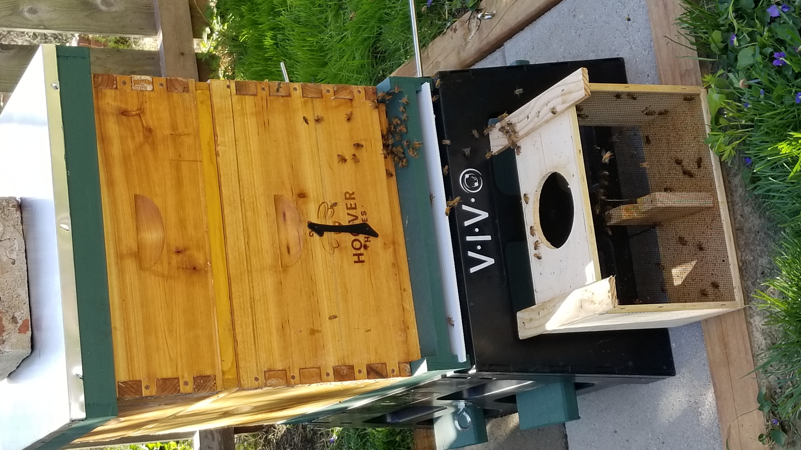
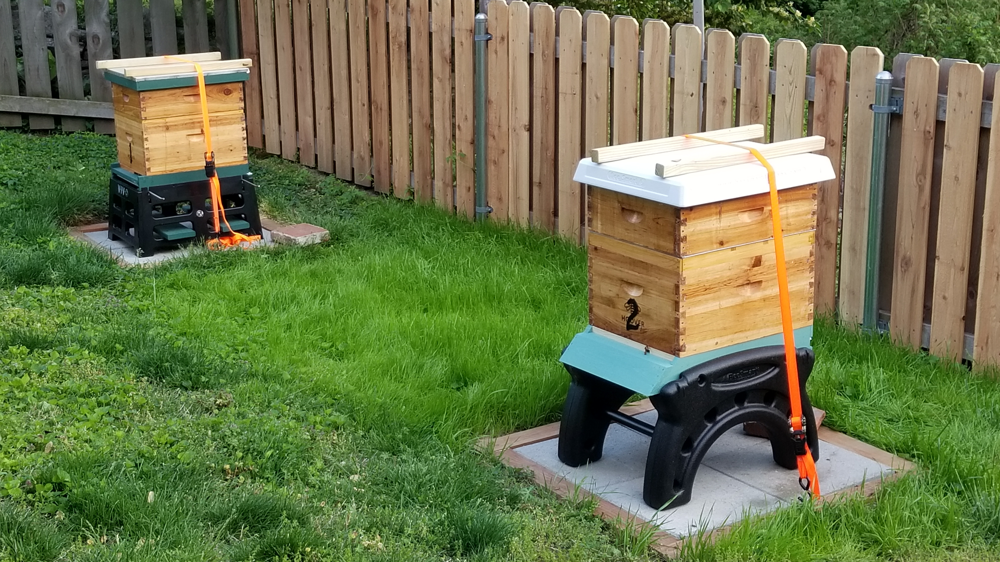
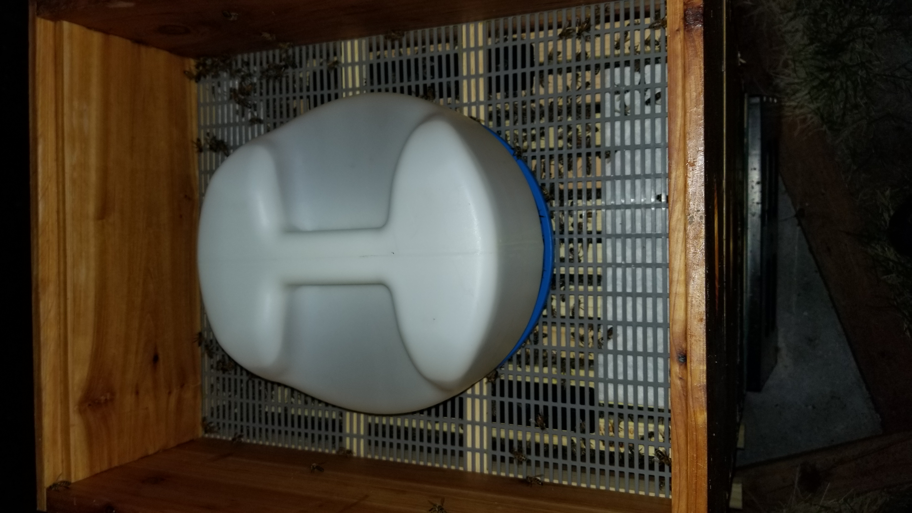
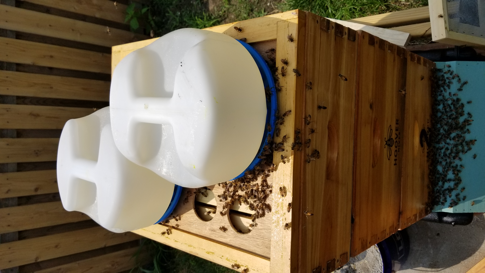
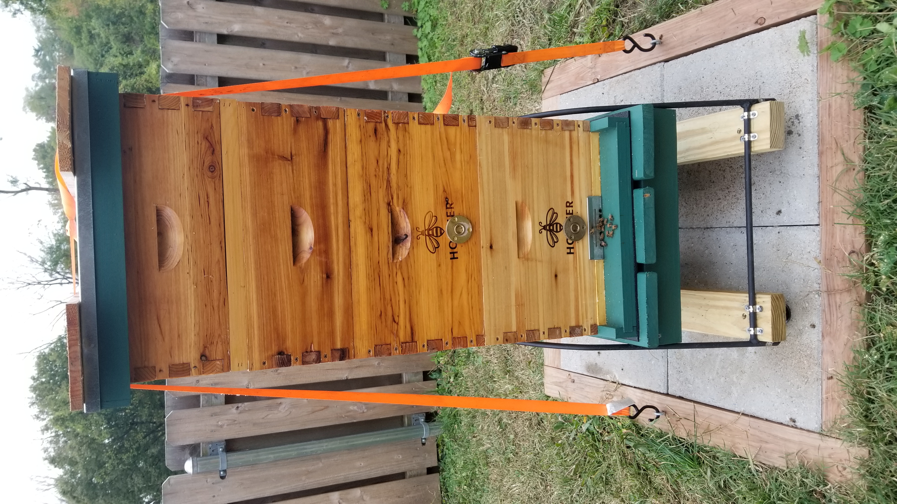
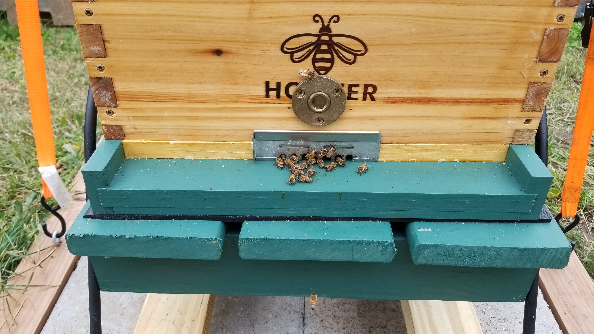
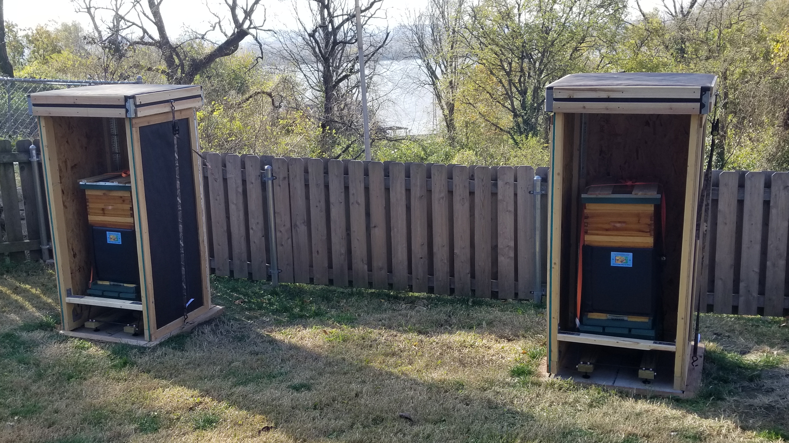

# Hives

## hive 1 (installed 4/13/2021)

  

## hive 2 (installed 5/5/2021)

  

## Secured to stand

  

## Second Brood

  

## Single Feeder [ultimate feeder](http://www.littlehouseonthebighill.com/beekeeping/index.php?detail=280)

  

## Double feeder

  

# winter prep

## winter stands with solid bottom

  

## mouse guard

  

## bee chalet

  

