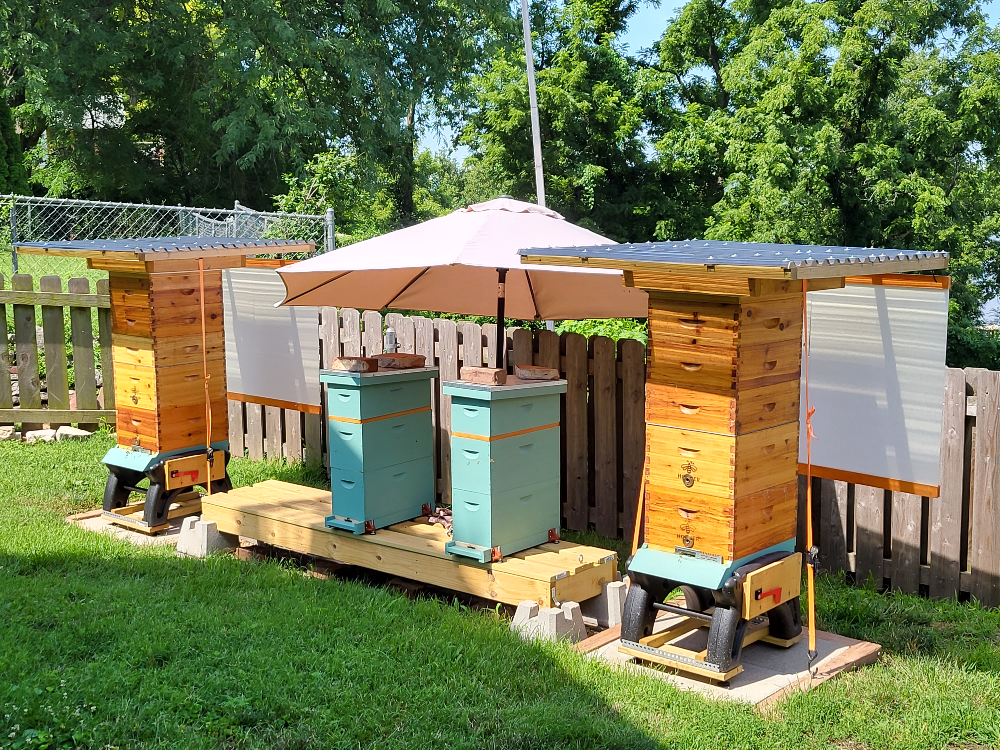

# Hives

## hive 1 (installed 4/13/2021)

  

## hive 2 (installed 5/5/2021)

  

## Secured to stand

  

## Second Brood

  

## Single Feeder [ultimate feeder](http://www.littlehouseonthebighill.com/beekeeping/index.php?detail=280)

  

## Double feeder

  

# winter prep

## winter stands with solid bottom

  

## mouse guard

  

## bee chalet

  

# summer 2022
- both existing hives survived the winter
- hive 1 swarmed 1 time
- hive 2 swarmed 3 times
- trapped 2 wild swarms to establish nucs
  - got a case of EFB for my troubles...
- [requeened](https://www.brawes-bee-farm.com/p/queen/) hive 2

  

# winter 22 - 23
- combined nucs on single stand
  - made wrap out of 10 mill plastic r30 insulation
  - corplast snow sheild 
- bee chalets in place   

  

