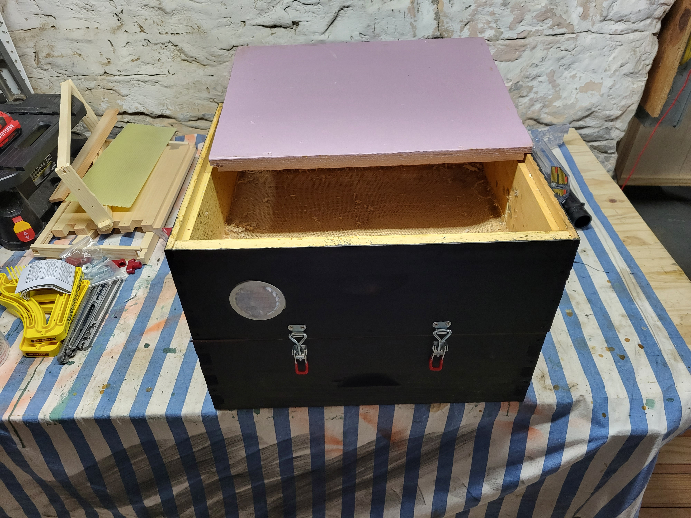
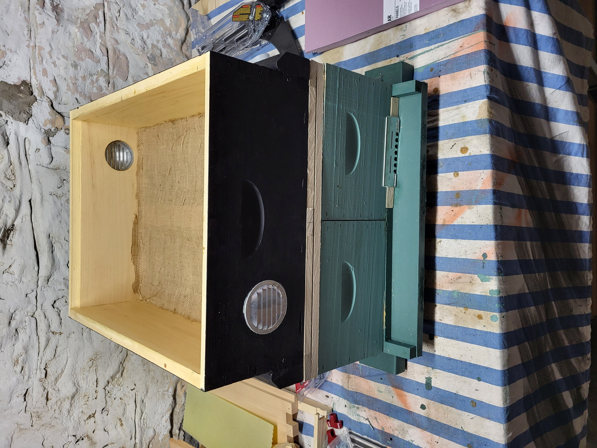
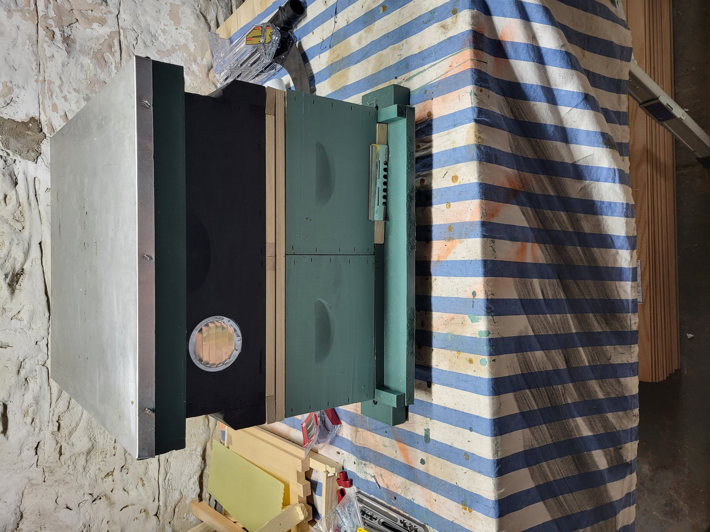
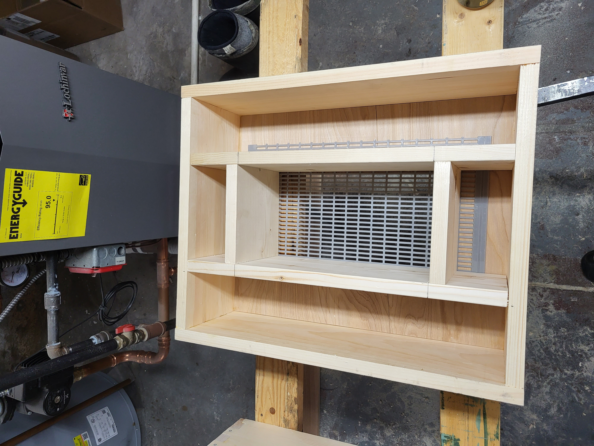
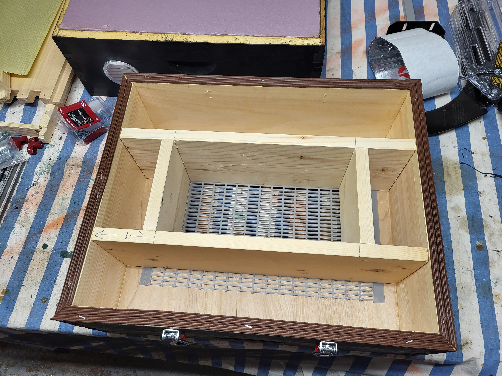
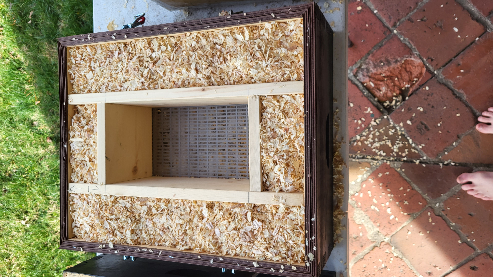
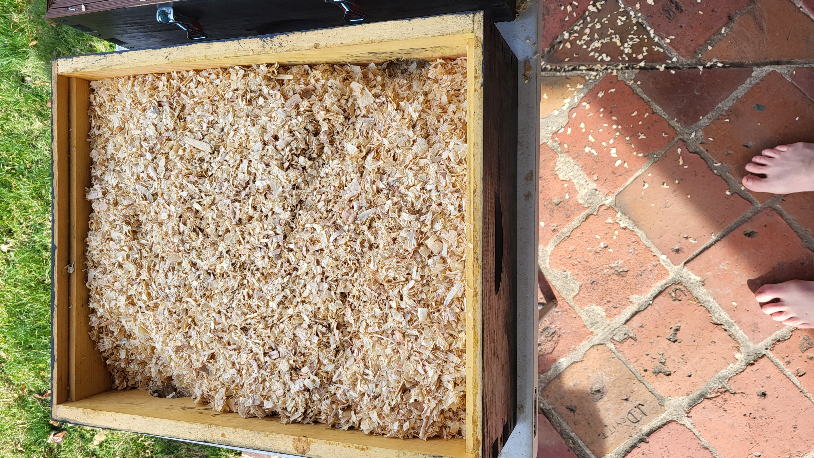
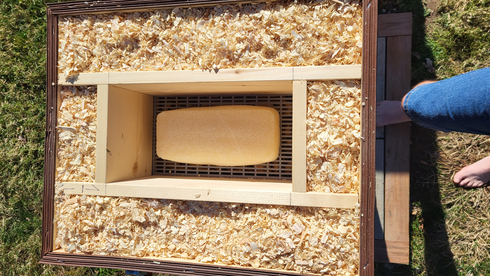

# moisture box and sugar brick feeder

  

## BOM
- medium box 
- 1/2 inch construction cloth
- burlap
- soffit vents
- plastic queen excluder
- 1/2 inch square pine strips
- 2 x 4 for extending siding for nucs
- weather stripping
- toggle latch clamps
- black stain
- wood chips

## nuc moisture box

  

  

## moisture box

  

  

## feeder box

  

  

## add chips but don't pack tight

  

make sure vents are clear

  

## feeder with brick

  

